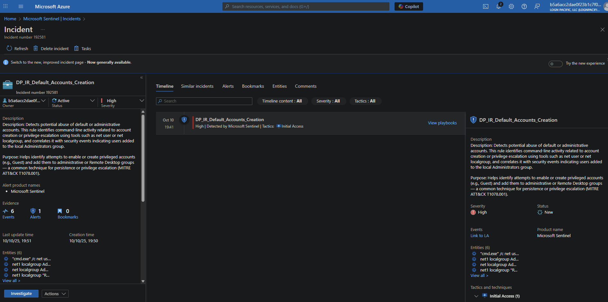
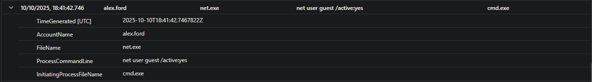
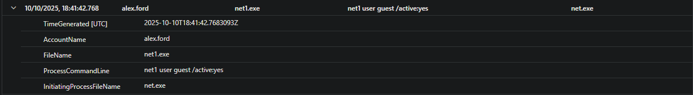
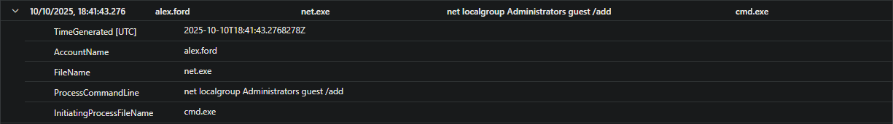
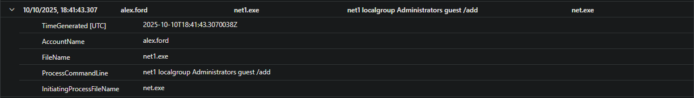
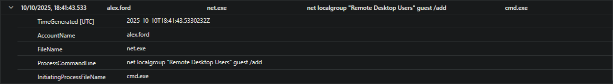
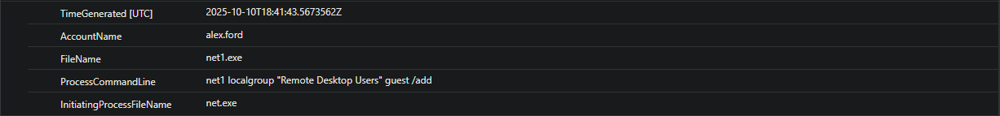
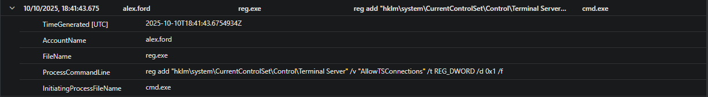
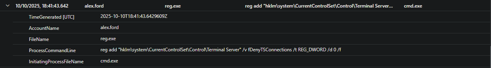

# 🕵️ SOC Investigation Log  
**Technique:** T1078.001 - Valid Accounts: Default Accounts  
**Test Folder:** `TXXXX.XXX-[short-name]/`  
**Date of Test:** 2025-10-11  
**Analyst:** Dushanka P.

---

## 🎯 Incident Summary

| Field               | Value                                            |
| ------------------- | ------------------------------------------------ |
| Alert Name          | DP_IR_Default_Accounts_Creation                  |
| MITRE ID            | T1078.001                                        |
| Alert Source        | Microsoft Sentinel                               |
| Detection Rule Type | Scheduled / Custom                               |
| Triggered By        | `cmd.exe` commands: `net user`, `net localgroup` |
| Alert Severity      | High                                             |
| Affected Host       | dp--art-sim--dp                                  |
| Username / Account  | guest                                            |

---

## 🧠 Triage Questions

* **Was the behavior expected in this lab?**
  Yes, this was a controlled simulation.

* **Which artifacts prove the technique worked?**

  * Successful `net user` and `net1.exe` commands
  * Group membership changes (Administrators, Remote Desktop Users)
  * Registry modifications to enable RDP

* **Did it cause any follow-up processes or network activity?**
  No evidence of external network connections or suspicious follow-up processes in the immediate aftermath. No RDP logins detected—just setup actions.

* **Was the user elevated or used for RDP?**
  Yes. The `guest` account was enabled, had its password set, added to Administrators and Remote Desktop Users groups, and RDP was enabled via registry change.

* **Any lateral movement or signs of privilege escalation?**
  No lateral movement observed. Privilege escalation occurred (guest added to privileged groups), but no attempts to move to other hosts detected.

---

## 📂 Timeline (Key Events)

| Time (VM Local) | Time (Sentinel/UTC) | Event Description                                                                |
| --------------- | ------------------- | -------------------------------------------------------------------------------- |
| 18:41:40        | 19:41:40            | Recon: `whoami.exe` and `hostname.exe` run to check context                      |
| 18:41:42        | 19:41:42            | `cmd.exe` runs multiple commands: enables guest, adds to Admin/RDP, enables RDP  |
| 18:41:43        | 19:41:43            | `net1.exe`/`net.exe` add guest to Administrators and Remote Desktop Users groups |
| 18:41:43        | 19:41:43            | `reg.exe` modifies Terminal Server registry to allow RDP                         |
| 18:41:43        | 19:41:43            | Guest password set (`net1.exe user guest Password123!`)                          |
| 18:41:43        | 19:41:43            | Verification: `whoami.exe`, `hostname.exe` (context after changes)               |
| 18:41:41+       | 19:41:41+           | **Sentinel alert triggered (DP_IR_Default_Accounts_Creation)**                   |

---

## 🔍 Artifacts Observed

| Artifact Type           | Evidence Found                                                                        |
| ----------------------- | ------------------------------------------------------------------------------------- |
| Security Events         | 4722 (user enabled), 4732 (added to group)                                            |
| Command Line            | `net user`, `net1.exe`, `net localgroup`, `reg add`                                   |
| Registry Keys           | `HKLM\SYSTEM\CurrentControlSet\Control\Terminal Server\fDenyTSConnections` (set to 0) |
| Defender Logs           | Alert triggered by Sentinel: `DP_IR_Default_Accounts_Creation`                        |
| Network Logs (optional) | No RDP (3389) login attempts observed in this window                                  |

---

## 🧼 Cleanup Verification

- [x] Guest account disabled
- [x] Removed from Admin group
- [x] RDP registry reverted
- [x] VM snapshot restored (if used)

---

## 🧪 Notes & Improvements

- [Detection rule improvements or logic tuning ideas]
- [EDR/Defender coverage observations]
- [Any false positive considerations]
- [Follow-up test ideas or chaining concepts]

---

## 📸 Screenshots / Evidence

---

**Sentinel alert for default account abuse detected**  
  
*Sentinel alert for default account abuse detected (DP_IR_Default_Accounts_Creation).*

---

**Guest enabled via net.exe**  
  
*Process event: `net.exe` enables guest account (initiated by `cmd.exe`).*

---

**Guest enabled via net1.exe**  
  
*Process event: `net1.exe` enables guest account (initiated by `net.exe`).*

---

**Guest added to Administrators group via net.exe**  
  
*Guest account added to Administrators group via `net.exe` (initiated by `cmd.exe`).*

---

**Guest added to Administrators group via net1.exe**  
  
*Guest account added to Administrators group via `net1.exe` (initiated by `net.exe`).*

---

**Guest added to Remote Desktop Users group via net.exe**  
  
*Guest account added to Remote Desktop Users group via `net.exe`.*

---

**Guest added to Remote Desktop Users group via net1.exe**  
  
*Guest account added to Remote Desktop Users group via `net1.exe`.*

---

**Registry change: AllowTSConnections**  
  
*Registry key `AllowTSConnections` set to `1` to enable RDP.*

---

**Registry change: fDenyTSConnections**  
  
*Registry key `fDenyTSConnections` set to `0` to enable RDP.*

---

[Download exported logs](./artifacts/exported-logs.csv)

---

## ✅ Outcome

✅ Incident successfully simulated and detected.  
🛠️ Detection logic verified.  
🕵️ Investigation completed.

---
