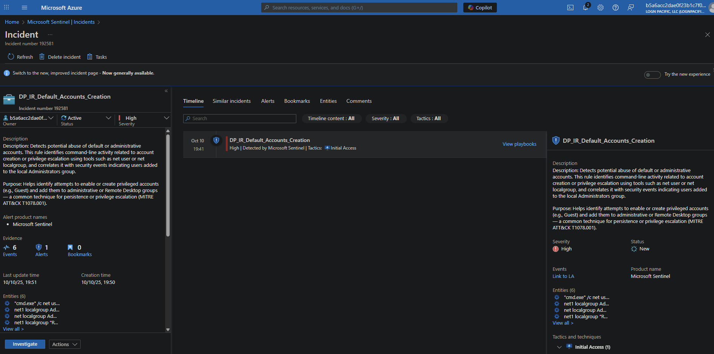
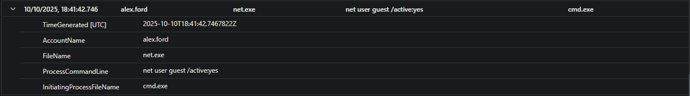
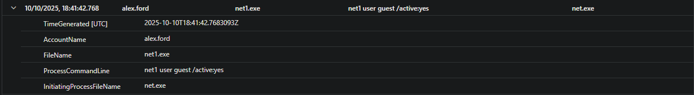
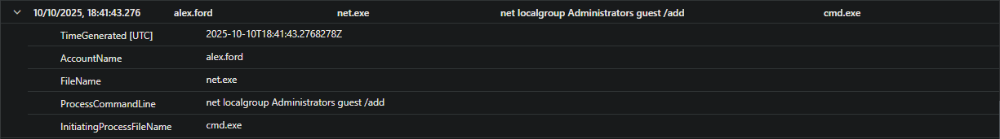
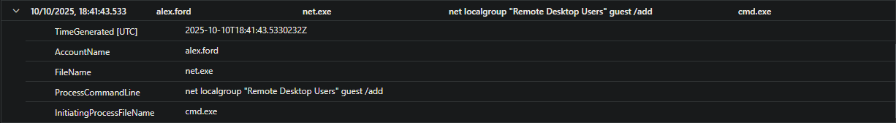
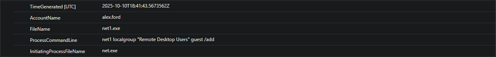
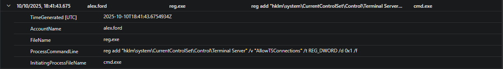
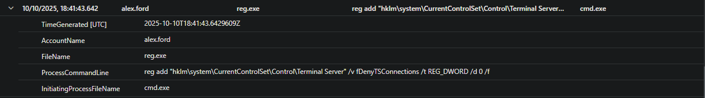

# 🕵️ Incident Report: Default Accounts — T1078.001

**Date:** 2025-10-11  
**Analyst:** Dushanka P.  
**MITRE ATT&CK:** [T1078.001 – Valid Accounts: Default Accounts](https://attack.mitre.org/techniques/T1078/001/)  
**Tactics:** Initial Access  
**Related Folders:** [atomic-red-team/03-initial-access/t1078.001-Default Accounts/](../../atomic-red-team/03-initial-access/t1078.001-Default%20Accounts/)

---

## 🎯 Incident Summary

| Field         | Value                                            |
| ------------- | ------------------------------------------------ |
| Alert Name    | DP_IR_Default_Accounts_Creation                  |
| MITRE IDs     | T1078.001                                        |
| Source        | Microsoft Sentinel                               |
| Severity      | High                                             |
| Host/User     | dp--art-sim--dp / guest                          |

---

## 🧠 Key Questions & Answers

- **Was this behavior expected (lab, sim, or real event)?**  
  Yes, this was a controlled lab simulation.

- **Which artifacts/evidence prove the technique(s) worked?**  
  - Successful `net user` and `net1.exe` commands
  - Group membership changes: Administrators and Remote Desktop Users
  - Registry modifications to enable RDP

- **Any lateral movement, escalation, or follow-up activity?**  
  No lateral movement observed; privilege escalation succeeded (guest added to privileged groups); no movement to other hosts.

- **Any external network or suspicious process activity?**  
  No evidence of external network connections or suspicious follow-up processes. No RDP logins detected—only setup actions.

---

## 📂 Timeline

| Time (VM Local) | Time (Sentinel/UTC) | Description                                                                |
| --------------- | ------------------- | -------------------------------------------------------------------------- |
| 18:41:40        | 19:41:40            | Recon: `whoami.exe`, `hostname.exe`                                        |
| 18:41:42        | 19:41:42            | `cmd.exe` runs: enables guest, adds to Admin/RDP, enables RDP              |
| 18:41:43        | 19:41:43            | `net1.exe`/`net.exe` add guest to Administrators and Remote Desktop Users   |
| 18:41:43        | 19:41:43            | `reg.exe` modifies Terminal Server registry to allow RDP                   |
| 18:41:43        | 19:41:43            | Guest password set (`net1.exe user guest Password123!`)                     |
| 18:41:43        | 19:41:43            | Verification: `whoami.exe`, `hostname.exe` (context after changes)          |
| 18:41:41+       | 19:41:41+           | **Sentinel alert triggered (DP_IR_Default_Accounts_Creation)**              |

---

## 🔍 Artifacts

| Type             | Evidence                                                                         |
| ---------------- | -------------------------------------------------------------------------------- |
| Security Events  | 4722 (user enabled), 4732 (added to group)                                       |
| Command Line     | `net user`, `net1.exe`, `net localgroup`, `reg add`                              |
| Registry Keys    | `HKLM\SYSTEM\CurrentControlSet\Control\Terminal Server\fDenyTSConnections` = 0    |
| Defender Logs    | Sentinel alert: `DP_IR_Default_Accounts_Creation`                                |
| Network Logs     | No RDP (3389) login attempts observed in this window                             |

---

## 🧼 Cleanup

- [x] Guest account disabled
- [x] Removed from Admin group
- [x] RDP registry reverted
- [x] VM snapshot restored (if used)

---

## 📝 Lessons & Improvements

- **Detection rule improvements:**  
  - Add checks for both `net.exe` and `net1.exe` (attackers use both)
  - Rule should also alert on registry changes for RDP, not just group changes
  - Watch for duplicate alerts if commands are chained

- **Coverage findings:**  
  - Sentinel detection worked as expected
  - No Defender alert observed—review Defender logs/settings
  - Ideally Defender should alert on suspicious group/registry changes

- **Next steps/chaining:**  
  - Try RDP login as guest and monitor for detection
  - Attempt lateral movement from the guest account
  - Chain with persistence/exfil tests to evaluate stacked detections

---

## 📸 Screenshots / Evidence

**Sentinel alert for default account abuse detected**  

*Sentinel alert for default account abuse detected (DP_IR_Default_Accounts_Creation).*

---

**Guest enabled via net.exe**  

*Process event: `net.exe` enables guest account (initiated by `cmd.exe`).*

---

**Guest enabled via net1.exe**  

*Process event: `net1.exe` enables guest account (initiated by `net.exe`).*

---

**Guest added to Administrators group via net.exe**  

*Guest account added to Administrators group via `net.exe` (initiated by `cmd.exe`).*

---

**Guest added to Administrators group via net1.exe**  

*Guest account added to Administrators group via `net1.exe` (initiated by `net.exe`).*

---

**Guest added to Remote Desktop Users group via net.exe**  

*Guest account added to Remote Desktop Users group via `net.exe`.*

---

**Guest added to Remote Desktop Users group via net1.exe**  

*Guest account added to Remote Desktop Users group via `net1.exe`.*

---

**Registry change: AllowTSConnections**  

*Registry key `AllowTSConnections` set to `1` to enable RDP.*

---

**Registry change: fDenyTSConnections**  

*Registry key `fDenyTSConnections` set to `0` to enable RDP.*

---

> **Outcome:**  
> Incident successfully simulated and detected. Detection logic worked as expected—alert triggered on intended actions. Investigation completed with all steps and evidence documented. No further suspicious activity or lateral movement observed after test.

